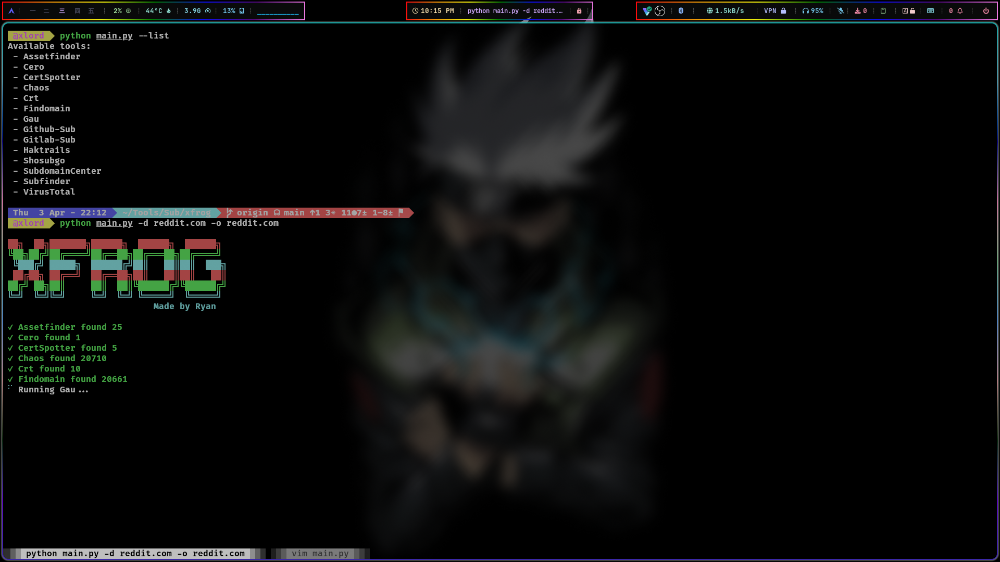

# 🎯xFROG Subdomain Enumeration Framework

**Fast · Modular · Multi-threaded · Beautiful CLI · API-integrated**


<p>
  
</p>

---

## 🔥 Features

- ✅ **FAST** multithreaded scanning (`-t`)
- ✅ **Modular + CLI tool support**
- ✅ **API integration** for VirusTotal, CertSpotter, Censys, etc.
- ✅ **EASY to add new tools** (plug-and-play system)
- ✅ **Clean error handling** (`Api-Key`, `Not Found`, etc.)
- ✅ **Logging** to `log.txt` and output to file
- ✅ Tool control: `--list`, `--version`, `--threads`, `--use`, `--exclude`

---

## ⚙️ Installation

### 📦 Requirements

```bash
python3 -m pip install -r requirements.txt
```

<details>
<summary><code>requirements.txt</code> contents</summary>

```txt
halo
colorama
requests
```
</details>

---

## 🚀 Usage

### 🔍 Basic Scan

```bash
python3 main.py -d example.com
```

### 🧵 Run with 10 Threads

```bash
python3 main.py -d example.com -t 10
```

### 🎯 Specific Tools Only

```bash
python3 main.py -d example.com -u Crt,CertSpotter,Subfinder
```

### 🙈 Exclude Tools

```bash
python3 main.py -d example.com -e Chaos,Github-Sub
```

### 💾 Save to Output File

```bash
python3 main.py -d example.com -o result.txt
```

### 🧪 View Tools List

```bash
python3 main.py --list
```

---

## 🛠️ Supported Tools

| Module-Based      | CLI-Based        |
|-------------------|------------------|
| [`Crt`](https://crt.sh)              | [`Subfinder`](https://github.com/projectdiscovery/subfinder)     |
| [`CertSpotter`](https://sslmate.com/labs/certspotter/) | [`Assetfinder`](https://github.com/tomnomnom/assetfinder)     |
| [`Censys (Paid)`](https://censys.io/) | [`Findomain`](https://github.com/Findomain/Findomain)           |
| [`VirusTotal`](https://www.virustotal.com) | [`Chaos`](https://github.com/projectdiscovery/chaos-client)       |
| [`SubdomainCenter`](https://subdomain.center/) | [`Gau`](https://github.com/lc/gau), [`Cero`](https://github.com/glebarez/cero), [`Shosubgo`](https://github.com/incogbyte/shosubgo) |
| — | [`Haktrails`](https://github.com/hakluke/haktrails), [`Github-Sub`](https://github.com/gwen001/github-subdomains), [`Gitlab-Sub`](https://github.com/gwen001/gitlab-subdomains) |


---

## 📁 Output

- Subdomains saved to: `example.com.txt` or `-o <file>`
- Logs saved to: `log.txt`

---

## 🧠 API Keys Required

Create an `api.txt` file like this:

```txt
CERTSPOTTER_API_KEY=your_key
VIRUSTOTAL_API_KEY=your_key
CENSYS_API_ID=your_id
CENSYS_API_SECRET=your_secret
GITHUB_API_KEY=your_key
GITLAB_API_KEY=your_key
SHODAN_API_KEY=your_key
CHAOS_API_KEY=your_key
```

---

## ❤️ Credits

- Developed by [**Ryan**](https://facebook.com/0xL30)
- Credits **ChatGPT** & **Deepseek**

---

## 📄 License

MIT License
